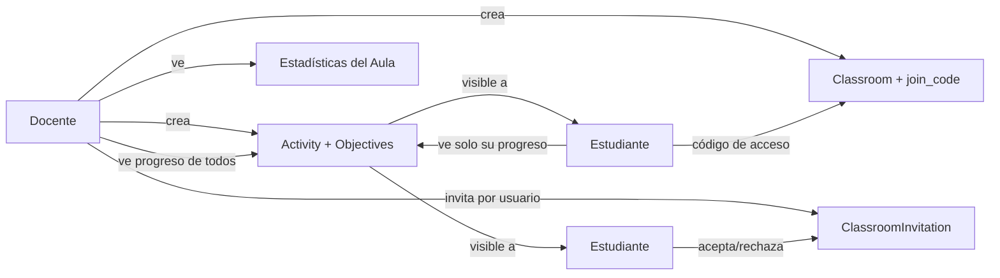

# Módulo de Aulas (`apps.classrooms`) — Fase 5

## 1. Objetivo

Convertir la plataforma en una herramienta de uso continuo durante el año escolar: un docente
crea un aula, inscribe estudiantes, asigna actividades con objetivos medibles (mezclando
problemas, partidas, análisis y creación de contenido) y hace seguimiento del progreso —
siempre respetando la privacidad de cada estudiante.

## 2. Modelos

### `Classroom`
Aula persistente propiedad de uno o más docentes (`teachers`, M2M — permite co-docencia).
- `join_code`: código corto autogenerado (`secrets.token_hex(4)`) para que un estudiante se
  inscriba por sí mismo. Regenerable vía `regenerate_join_code()`.
- `is_active`: permite desactivar un aula sin perder el historial.
- `is_teacher(user)` / `is_member(user)`: helpers de permisos usados en todas las vistas.

### `ClassroomEnrollment`
Inscripción de un estudiante (`unique_together = [classroom, student]`). Al remover a un
estudiante se marca `is_active=False` en lugar de borrar la fila, preservando el historial de
actividades/progreso ya generado.

### `ClassroomInvitation`
Invitación directa y dirigida (`PENDING`/`ACCEPTED`/`DECLINED`/`CANCELLED`) de un docente a un
estudiante concreto, como alternativa al código de acceso genérico — mismo patrón que
`games.Challenge`.

### `Activity`
Unidad de trabajo con fecha de asignación y fecha límite opcional, ej. *"Semana 3 — Finales de
peones"*:
- `puzzles` (M2M a `training.Puzzle`, opcional): lista curada de problemas específicos.
- `assigned_students` (M2M, opcional): subconjunto de estudiantes; si está vacío, aplica a **todo
  el aula** (`target_students()`).
- `is_visible_to(user)`: el docente del aula siempre puede verla; un estudiante solo si está en
  `target_students()`.

### `ActivityObjective`
Meta medible dentro de una actividad: `SOLVE_PUZZLES`, `PLAY_GAMES`, `ANALYZE_GAME`,
`CREATE_PUZZLE`, cada una con un `target_count` (ej. "resolver 5 problemas", "jugar 2 partidas").
Una actividad no está limitada a un solo tipo de objetivo — se pueden combinar varios, tal como
en el ejemplo del enunciado (5 problemas + 2 partidas + 1 análisis + 1 problema creado).

## 3. Cálculo de progreso — sin duplicar datos

`ActivityProgressService` no mantiene contadores propios: calcula el progreso consultando en
vivo los modelos ya existentes de fases anteriores, acotado al período `[assigned_date,
due_date]` de la actividad:

| Objetivo | Fuente de datos |
|---|---|
| `SOLVE_PUZZLES` | `PuzzleAttempt(solved=True)` del estudiante; si la actividad tiene `puzzles` específicos, solo cuentan esos. |
| `PLAY_GAMES` | `Game` finalizadas (`FINISHED`) donde el estudiante jugó. |
| `ANALYZE_GAME` | `AnalysisJob(status=COMPLETED)` del estudiante. |
| `CREATE_PUZZLE` | `Puzzle` cuyo `author` es el estudiante. |

`compute_progress(activity, student)` devuelve el detalle por objetivo (`achieved`/`target`/
`completed`) y `is_complete` (todas las metas cumplidas). Se usa tanto para la vista del docente
(progreso de todos los estudiantes asignados) como para la del estudiante (su propio progreso).

## 4. Vistas y flujo

Rutas principales: `classroom_list`, `classroom_create`, `classroom_join`,
`classroom_invite_student`, `classroom_invitations` (+ `accept`/`decline`),
`classroom_remove_student`, `activity_create`, `activity_detail`, `classroom_stats`,
`classroom_student_progress`.

## 5. Permisos

| Acción | Quién puede |
|---|---|
| Crear un aula | Cualquier usuario con rol `TEACHER`/`ADMIN` o `is_staff`. |
| Ver el detalle de un aula | Docentes del aula, o estudiantes con inscripción activa (`is_member`). |
| Ver el código de acceso / gestionar el listado de inscritos | Solo docentes del aula. |
| Invitar / quitar estudiantes | Solo docentes del aula. |
| Crear / ver progreso agregado de una actividad | Solo docentes del aula. |
| Ver una actividad | Docentes del aula, o estudiantes en `target_students()` de esa actividad. |
| Ver estadísticas del aula (`classroom_stats`) | Solo docentes del aula — nunca estudiantes. |
| Ver el progreso individual de un estudiante | Los docentes **de esa aula** (no de otra), o el propio estudiante sobre sí mismo. |

Todas las vistas basadas en clase comprueban primero `request.user.is_authenticated` (delegando en
`LoginRequiredMixin` para redirigir a login) antes de evaluar permisos de rol/pertenencia, de
modo que un usuario anónimo siempre recibe una redirección a login (302) y no un 403 engañoso.

## 6. Privacidad

- **Un estudiante nunca puede leer las estadísticas de otro estudiante**: `StudentProgressDetailView`
  exige `is_teacher(classroom) OR is_self`, y además siempre exige que el estudiante consultado
  esté realmente inscrito en **esa** aula.
- **Un docente no puede usar el id de un estudiante de otra aula para ver su progreso**: aunque
  `is_teacher` sea verdadero para su propia aula, la vista exige que el estudiante objetivo esté
  inscrito activamente en esa aula concreta (cubierto por
  `test_teacher_from_other_classroom_cannot_view_unrelated_student_progress`).
- **Sin comparación pública**: `ClassroomStatsService.classroom_summary` devuelve una lista
  ordenada alfabéticamente (nunca por rendimiento) y cada tarjeta en la plantilla se presenta de
  forma individual — no hay ranking, puntaje comparativo ni tabla de posiciones. El objetivo es
  progreso individual, no competencia entre compañeros.
- **`classroom_stats` es estrictamente para docentes**: ningún estudiante puede acceder a la vista
  agregada, ni siquiera para ver su propia fila mezclada con las de otros.

## 7. Tests

Ver [tests/test_classrooms.py](../../tests/test_classrooms.py): creación de aulas (permiso de
rol), inscripción por código (válido/ inválido), invitaciones (aceptar/rechazar/ajenas),
remoción de estudiantes, visibilidad del detalle de aula, creación de actividades con múltiples
objetivos, visibilidad de actividades restringidas a un subconjunto de estudiantes, cálculo de
progreso (problemas resueltos, partidas jugadas, partidas analizadas, problemas creados,
finalización de actividad), y privacidad (`classroom_stats` solo docentes; un estudiante no puede
ver el progreso de otro; un docente no puede ver el progreso de un estudiante ajeno a su aula).

## 8. Extensiones futuras

- Múltiples aulas por docente con vista consolidada de todas ellas.
- Notificaciones cuando se asigna una nueva actividad o se acerca la fecha límite.
- Exportar reporte de progreso (PDF/CSV) por estudiante o por aula para reunión con
  familias/dirección.
- Actividades recurrentes/plantillas (ej. "actividad semanal" clonable).
- Vincular la moderación de problemas (Fase 4) al contexto del aula (hoy la moderación de
  `Puzzle` sigue siendo global entre cualquier docente, no específica de un aula).
