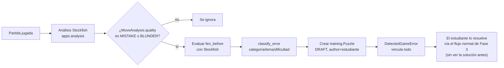

# Entrenamiento Personalizado (`apps.personalization`) — Fase 7

## 1. Objetivo

Usar el historial real del estudiante (partidas, análisis, problemas resueltos/fallados) para
recomendar en qué entrenar. **Primera versión basada en reglas explicables, sin IA compleja.**
Cada número y cada frase que ve el estudiante puede explicarse en una oración, y este documento
enumera exactamente esas reglas.

## 2. De una partida jugada a una posición de entrenamiento

Esta es la funcionalidad central de la fase, y reutiliza casi todo lo ya construido:



Pasos (`ErrorDetectionService.generate_from_job`, en
[services.py](services.py)), mapeados 1 a 1 con los 6 pasos pedidos en el enunciado:

1. **Identificar la posición** — se toma `MoveAnalysis.fen_before` de cada jugada ya marcada como
   `MISTAKE` o `BLUNDER` por el pipeline de análisis existente (Fase 2). No se reclasifica nada
   que Stockfish ya haya calculado; se reutiliza tal cual.
2. **Guardar la posición** — se copia a `DetectedGameError.fen_before` y se usa como
   `Puzzle.initial_fen`.
3. **Guardar la jugada del estudiante** — `student_move_uci`/`student_move_san` (la jugada real
   que ya estaba en `MoveAnalysis`).
4. **Guardar la mejor continuación** — el pipeline de análisis existente solo evalúa la posición
   *después* de cada jugada (para clasificar su calidad), no la posición *antes* con su mejor
   jugada. Por eso se hace **una evaluación adicional puntual** de `fen_before` con
   `StockfishEngine.evaluate_position` (con su mismo *fallback* heurístico si no hay binario de
   Stockfish) — solo para las jugadas ya marcadas como error, no para toda la partida.
5. **Clasificar el error** — ver la sección 3 (`error_classifier.py`).
6. **Convertir en una posición de entrenamiento** — se crea un `training.Puzzle` real con
   `status=DRAFT` y `author=<el estudiante>`. Gracias a los permisos ya implementados en la
   Fase 4 (`Puzzle` visible para su autor aunque esté en `DRAFT`), el estudiante puede
   **practicarlo de inmediato con la interfaz de resolución de problemas ya existente** —
   pistas progresivas, reintentos, sin revelar la solución — sin escribir una sola línea nueva de
   UI de resolución.

Disparo: un botón **"Generar Entrenamiento de mis Errores"** en la página de detalle de análisis
(`templates/analysis/analysis_detail.html`), visible cuando el trabajo de análisis está
`COMPLETED` y corresponde a una partida jugada en la plataforma (`job.game` no nulo). Es
**idempotente**: cada `MoveAnalysis` solo genera un `DetectedGameError` una vez
(`OneToOneField`), así que puede presionarse varias veces sin duplicar nada.

## 3. Clasificación del error (reglas explícitas, sin IA)

`apps/personalization/error_classifier.py::classify_error` aplica, **en este orden**:

1. **¿Mate forzado no visto?** Si la evaluación de `fen_before` reporta `mate_in > 0` a favor del
   jugador que movió, y la jugada del estudiante no fue esa jugada de mate →
   `categoría=TACTICS`, `tema=MATE`, `dificultad=BEGINNER` (perder un mate regalado suele ser
   fácil de ver una vez que se sabe dónde mirar).
2. **¿Fase de apertura?** Si `board.fullmove_number <= 10` → `categoría=OPENINGS`,
   `tema=OPENING_REPERTOIRE`.
3. **¿Final?** Si quedan 6 o menos piezas mayores/menores en el tablero (heurística simple de
   "final") → `categoría=ENDGAME`, con sub-tema según qué piezas quedan: solo peones y reyes →
   `PAWN_ENDGAME`; con torres y sin alfiles/caballos → `ROOK_ENDGAME`; con alfiles/caballos y sin
   torres → `MINOR_PIECES_ENDGAME`; mezcla → `BEST_CONTINUATION` (tema genérico ya existente).
4. **Caso general (medio juego)** → `categoría=TACTICS`, `tema=BEST_CONTINUATION`. Deliberadamente
   **no** se intenta adivinar patrones tácticos específicos (horquilla, clavada, enfilada) porque
   eso requeriría reconocimiento de patrones que el motor no entrega directamente — se prefiere
   un tema honesto y genérico antes que uno inventado.
5. **Dificultad**: además de la regla de mate, cualquier jugada clasificada como `BLUNDER` (el
   error más grande) se reclasifica como `BEGINNER` para volver a intentarla, bajo la premisa de
   que un error grande suele ser más fácil de corregir una vez señalado que uno sutil.

Todo esto es una **simplificación documentada**, no un motor de reconocimiento de patrones. La
sección 7 explica cómo mejorarlo.

## 4. Perfil de práctica — indicadores, no un coeficiente intelectual

`StudentProfileService.compute_profile(user)` calcula un indicador (0-100) para **exactamente
los seis indicadores pedidos**: Táctica, Cálculo, Aperturas, Finales, Defensa, Ataque
(`Puzzle.Category` tiene además Estrategia y Medio Juego, disponibles en el resto del sistema pero
no mostrados como indicador principal todavía).

Fórmula, por categoría:

```
tasa_aciertos = intentos_exitosos / intentos_totales * 100   (UserTrainingStats, Fase 3)
penalización   = min(30, errores_detectados_últimos_60_días * 5)   (DetectedGameError)

si no hay intentos NI errores  →  indicador = None ("Sin datos suficientes")
si hay errores pero no intentos → base = 50 (neutral, no se inventa una tasa de aciertos)
indicador = clamp(0, 100, tasa_aciertos_o_base − penalización)
```

**En cada pantalla donde se muestra este número aparece el siguiente texto, literal y
obligatorio**: *"Estos indicadores reflejan tu práctica reciente, no una medición de tu
inteligencia ni de tu nivel de ajedrez."* Esto no es solo una nota de diseño: es una obligación
explícita del enunciado de la fase y se implementó como texto visible permanente en
`templates/personalization/dashboard.html`, no como un tooltip opcional.

## 5. Recomendaciones semanales

`RecommendationService.build_weekly_recommendations(user)` (sin persistencia — se recalcula cada
vez que se visita el panel, siempre con datos frescos) genera hasta 4 tipos de sugerencia,
**cada una con su propia regla explicable**:

| Regla | Fuente de datos | Cantidad objetivo |
|---|---|---|
| Tema débil (≥2 intentos, <50% aciertos) | `UserTrainingStats` (Fase 3) | 3 problemas públicos del tema |
| Categoría con más errores recientes (30 días) | `DetectedGameError` | 2 de sus propias posiciones generadas |
| Errores de apertura propios | `DetectedGameError` (categoría Aperturas) | 5 posiciones — mismo número que el ejemplo del enunciado |
| Errores de defensa / ataque propios | `DetectedGameError` | 1 posición por categoría |

Cada elemento trae un campo `reason` en texto plano (ej. *"Detectamos 3 error(es) de Táctica en
tus partidas recientes: revisa 2 de esas posiciones"*) y la lista de `Puzzle` concretos a
resolver — nunca un número sin explicación. Los problemas ya resueltos (`PuzzleAttempt.solved`)
se excluyen siempre. Si no hay datos suficientes, la lista queda vacía y la plantilla lo indica
claramente en vez de inventar una recomendación.

Ejemplo real que reproduce el del enunciado (con datos suficientes acumulados):

> **3** — Has acertado solo el 25.0% de tus intentos en Clavada: practica 3 más.
> **2** — Detectamos 4 error(es) de Táctica en tus partidas recientes: revisa 2 de esas posiciones.
> **1** — Refuerza tu defensa con 1 posición(es) propia(s).
> **5** — Tienes 5 posición(es) de tu propia apertura para repasar.

## 6. Privacidad

- El panel (`PersonalizationDashboardView`) y "Mis Errores" (`MyDetectedErrorsListView`) están
  **siempre** filtrados por `request.user` — no existe una URL que reciba el id de otro usuario,
  así que no hay superficie de ataque para consultar el perfil de un compañero.
- Los puzzles generados automáticamente se crean con `status=DRAFT`, visibles solo para su autor
  (el propio estudiante) y para docentes/staff (igual que cualquier otro borrador, Fase 4) — nunca
  aparecen en el listado público de entrenamiento ni son resolubles por otros estudiantes.
- Generar entrenamiento a partir de un `AnalysisJob` requiere ser participante de la partida o
  personal docente/administrador (`generate_training_from_job`, mismo criterio de permisos que
  `apps.analysis.create_game_analysis_job`).

## 7. Cómo evolucionar hacia modelos más avanzados

Esta primera versión es deliberadamente simple y auditable. Rutas de evolución, sin romper la
arquitectura actual:

- **Detección de patrones tácticos reales** (horquilla, clavada, enfilada, descubierta): hoy se
  usa el tema genérico `BEST_CONTINUATION` porque no hay reconocimiento de patrones; podría
  añadirse un analizador posicional (basado en reglas de ataques a piezas con `python-chess`, o
  un modelo entrenado) que reemplace únicamente `error_classifier.classify_error` sin tocar el
  resto del pipeline.
- **Persistir recomendaciones semanales** en lugar de recalcularlas siempre, para poder marcar
  "recomendación de la semana X completada" y medir adherencia a lo largo del tiempo.
- **Perfil ponderado por dificultad/tiempo empleado**: incorporar `PuzzleAttempt.time_taken_seconds`
  y `hints_used` a la fórmula del indicador (más pistas/tiempo usado = práctica más trabajosa).
- **Modelo de dificultad adaptativa** (estilo *puzzle rating* Elo) por tema, reemplazando el
  umbral fijo de "50% de aciertos" por un sistema de rating que suba/baje con cada intento.
- **Aprendizaje supervisado** sobre el histórico de `DetectedGameError` + resultados de
  `PuzzleAttempt` para predecir qué recomendación tiene mayor probabilidad de ser resuelta con
  éxito, una vez que haya suficiente volumen de datos — recién ahí tendría sentido introducir un
  modelo estadístico/ML, sustituyendo `RecommendationService` sin cambiar `DetectedGameError` ni
  el resto del sistema.

## 8. Tests

Ver [tests/test_personalization.py](../../tests/test_personalization.py) (29 tests):
clasificación de errores (apertura, final de peones/torres, mate no visto, táctica genérica,
dificultad de un *blunder*), conversión partida→entrenamiento (solo errores significativos,
atribución correcta por color/ply, creación de un `Puzzle` privado en `DRAFT` sin revelar la
solución en la descripción, idempotencia, validaciones de estado/partida vinculada), que el
puzzle generado es resoluble con el flujo de entrenamiento ya existente y privado para terceros,
permisos de vista (solo participantes/staff pueden generar; el panel y "mis errores" siempre
están acotados al propio usuario), indicadores de perfil (sin datos, con tasa de aciertos, con
penalización por errores, nunca negativo), y recomendaciones (vacías sin datos, temas débiles,
exclusión de problemas ya resueltos, agrupación por categoría de error, redacción dedicada para
aperturas).
