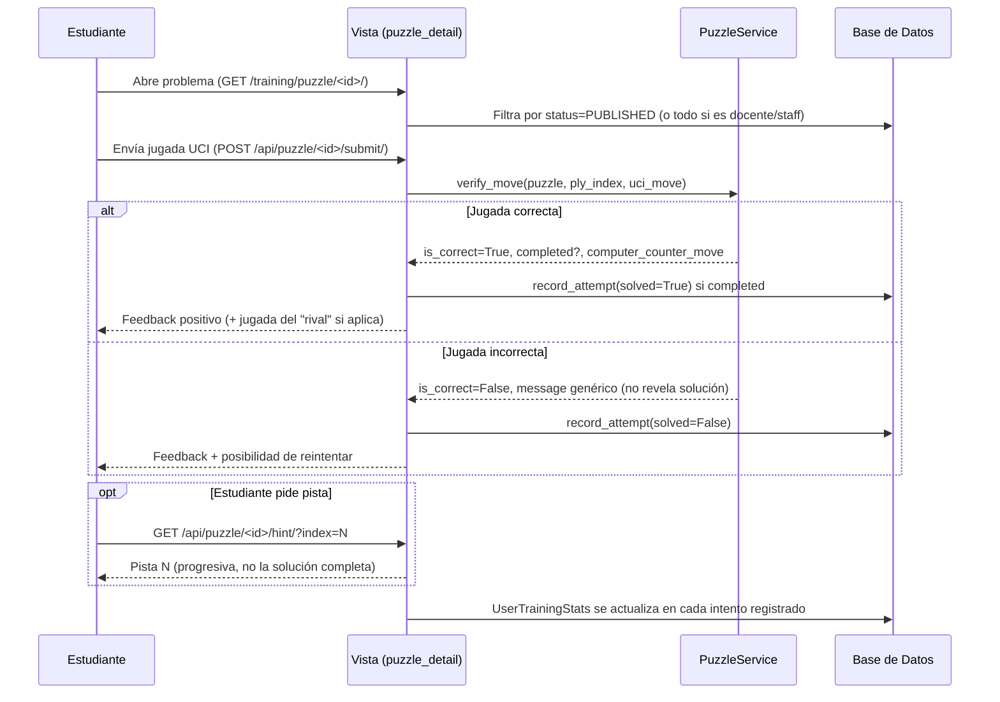
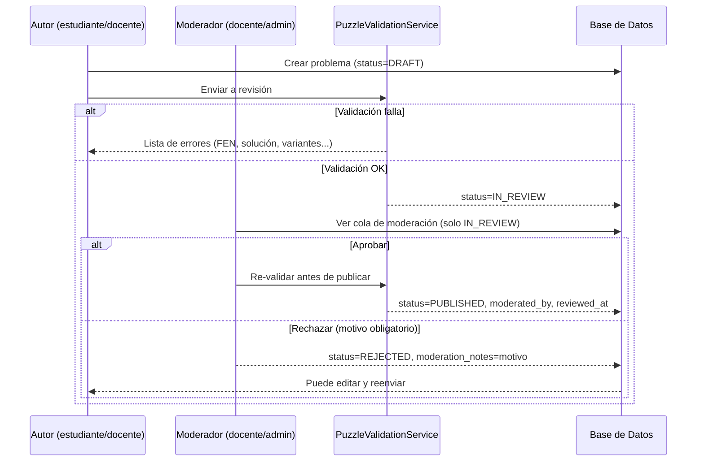

# Módulo de Entrenamiento (`apps.training`) — Fases 3 y 4

## 1. Objetivo

Sistema de entrenamiento de ajedrez flexible, no limitado a "mate en 1/2". Permite representar
problemas de táctica, cálculo, estrategia, aperturas, medio juego, finales, defensa, ataque y
posiciones prácticas, con feedback progresivo, pistas, reintentos y estadísticas adaptativas
(Fase 3), y convierte a estudiantes y docentes en autores de contenido mediante un creador de
problemas, un flujo de moderación y funciones de comunidad (Fase 4).

## 2. Modelos

### `Puzzle`
Representa cualquier posición de entrenamiento.

| Campo | Descripción |
|---|---|
| `initial_fen` | Posición inicial en FEN. Validada con `python-chess` en `clean()`/`save()`: se rechaza tanto un FEN sintácticamente inválido como una posición legal-por-FEN pero ilegal ajedrecísticamente (`board.is_valid()`), p. ej. dos reyes blancos. |
| `title`, `description`, `author` | Metadatos de autoría/contenido. |
| `category` | TACTICS, CALCULATION, STRATEGY, OPENINGS, MIDDLEGAME, ENDGAME, DEFENSE, ATTACK. |
| `theme` | Tema específico (horquilla, clavada, oposición, final de torres, final de piezas menores, repertorio de apertura, recurso defensivo, etc.). Extensible sin romper `category`. |
| `difficulty` | BEGINNER/INTERMEDIATE/ADVANCED/MASTER. |
| `side_to_move` | Lado que juega. |
| `objective` | Qué debe lograr el estudiante: `FIND_MOVE`, `FIND_SEQUENCE`, `WIN`, `DRAW`, `DEFEND`, `BEST_CONTINUATION`, `RECOGNIZE_IDEA`, `PRACTICE_OPENING`, `PRACTICE_ENDGAME`. No se asume jaque mate. |
| `solution_moves` | Lista JSON de jugadas UCI de la línea principal. |
| `variations_json` | Diccionario `{ "<ply_index>": ["uci1", "uci2", ...] }` de jugadas alternativas aceptadas en cada ply. |
| `hints` | Lista JSON de pistas progresivas (texto libre). |
| `status` | `DRAFT` / `IN_REVIEW` / `PUBLISHED` / `REJECTED` / `ARCHIVED` (ver Fase 4). Los estudiantes solo ven `PUBLISHED`, salvo sus propios problemas en cualquier estado; docentes/staff ven todo. |
| `moderated_by`, `moderation_notes`, `reviewed_at` | Metadatos de moderación: quién revisó el problema, notas/motivo de rechazo, y cuándo. |

`solution_moves` tiene `blank=True` a nivel de modelo: un problema puede guardarse como `DRAFT`
mientras se está redactando, sin solución todavía. `PuzzleValidationService` exige una solución
no vacía y reproducible antes de permitir el envío a revisión o la aprobación (ver sección 7).

Métodos de permisos en el propio modelo (evitan duplicar lógica en cada vista):
- `is_author(user)`
- `can_edit(user)`: moderadores siempre; el autor solo si el problema está en `DRAFT`/`REJECTED`.
- `can_delete(user)`: misma regla que `can_edit`.
- `can_submit_for_review(user)`: el autor, solo desde `DRAFT`/`REJECTED`.
- `average_rating` / `ratings_count`: agregados sobre `PuzzleRating`.

### `PuzzleFavorite`
Marca de un usuario sobre un problema publicado (`unique_together = [user, puzzle]`) para
encontrarlo luego en "Favoritos".

### `PuzzleRating`
Valoración educativa simple de 1 a 5 estrellas por usuario y problema (`unique_together`), con
validación de rango en `clean()`. Se usa solo como señal de valor educativo, no afecta el ranking
ELO del usuario.

### `PuzzleAttempt`
Registro histórico de cada intento evaluado (uno por envío que resulta en acierto o en fallo
registrado): usuario, puzzle, si se resolvió, número de intentos, pistas usadas, tiempo empleado.

### `UserTrainingStats`
Agregado por `(usuario, categoría, tema)`: `total_attempts`, `successful_attempts`,
`total_time_seconds`, y la propiedad calculada `success_rate`. Permite detectar temas débiles
(usado por el dashboard: temas con ≥2 intentos y `success_rate < 50%`).

## 3. Flujo de entrenamiento



Puntos clave:
- **No se revela la solución** ante un fallo: solo se informa que la jugada fue incorrecta.
- **Reintentos ilimitados**: el estudiante puede volver a intentar; cada intento se contabiliza.
- **Pistas opcionales y progresivas**: se sirven una por una vía `hints[index]`.
- **Secuencias multi-jugada**: si el objetivo requiere varias jugadas, el servidor devuelve
  la "respuesta" del bando contrario (`computer_counter_move`) tomada de `solution_moves`,
  y el cliente actualiza el tablero localmente sin exponer el resto de la solución.

## 4. Entrenamiento adaptativo

`TrainingDashboardView` calcula, por usuario, los `UserTrainingStats` con `success_rate < 50%`
y al menos 2 intentos, mostrándolos como "temas para reforzar". Esto es una base simple sobre la
que se puede construir recomendación de contenido (ver extensiones futuras).

## 5. Finales y aperturas

- El modelo no asume un formato específico de "jaque mate": un final de rey y peón puede
  modelarse con `objective=WIN` o `objective=DRAW` (p. ej. practicar la oposición para tablas) y
  `theme=OPPOSITION` / `PAWN_ENDGAME` / `ROOK_ENDGAME` / `MINOR_PIECES_ENDGAME`.
- Las aperturas se representan igual que cualquier otro `Puzzle` (`category=OPENINGS`,
  `objective=PRACTICE_OPENING`), sin una base de datos de aperturas dedicada todavía. La
  arquitectura (FEN + secuencia UCI + variantes) es compatible con incorporar más adelante un
  modelo `Opening`/`OpeningLine` relacionado, sin cambios estructurales en `Puzzle`.

## 6. Creación de problemas (Fase 4)

Cualquier usuario autenticado (estudiante o docente) puede crear problemas desde
`GET/POST /training/create/` (`PuzzleCreateView`), y editarlos desde
`GET/POST /training/puzzle/<id>/edit/` (`PuzzleEditView`) mientras tenga permiso (`can_edit`).

El creador (`templates/training/puzzle_creator.html` + `static/js/training_creator.js`) permite:
- **Colocar piezas**: paleta con las 12 piezas + borrador; clic en la paleta selecciona la
  herramienta activa, clic en el tablero coloca/borra en esa casilla.
- **Mover piezas**: sin herramienta activa, clic en una pieza y clic en el destino la reubica
  (edición libre de posición, sin validar legalidad — es un editor de posiciones, no una partida).
- **Cargar FEN**: cuadro de texto editable + botón "Cargar FEN" que reinterpreta el tablero.
- **Seleccionar quién juega**: selector Blancas/Negras que también fija el carácter de turno del FEN.
- **Metadatos**: título, descripción, categoría, tema, dificultad, objetivo.
- **Solución**: lista ordenada de jugadas UCI añadidas una a una.
- **Variantes**: jugadas alternativas aceptadas, asociadas a un índice de ply concreto.
- **Pistas**: lista ordenada de textos de ayuda progresiva.

El formulario envía estos datos como campos ocultos (`solution_moves`, `variations_json`, `hints`
serializados como JSON) junto con los campos simples del modelo. El backend nunca confía en el
cliente para la corrección ajedrecística: solo persiste lo recibido como `DRAFT`/edición, y la
validación fuerte ocurre al enviar a revisión o aprobar (sección 7).

## 7. Validación antes de publicar

`PuzzleValidationService.validate_for_submission(puzzle)` (usado tanto al enviar a revisión como
al aprobar) comprueba, devolviendo una lista de errores en español si algo falla:

1. FEN sintácticamente válido y posición ajedrecísticamente legal (`chess.Board.is_valid()`).
2. El lado que juega (`side_to_move`) coincide con el turno codificado en el FEN.
3. El problema tiene título.
4. Existe al menos una jugada en `solution_moves`.
5. **Reproducibilidad**: cada jugada de `solution_moves` es legal en formato UCI al reproducirse
   secuencialmente desde `initial_fen` (si una jugada es ilegal, se detiene y reporta cuál).
6. Las variantes en `variations_json` son legales en la posición correspondiente a su ply.

`PuzzleValidationService.engine_sanity_check(puzzle)` es **opcional e informativo** (no bloquea
la publicación): usa `StockfishEngine.evaluate_position` (con fallback heurístico si no hay
binario de Stockfish instalado) para mostrarle al moderador la evaluación de la posición inicial
y de la posición tras la primera jugada de la solución, ayudando a detectar soluciones sub-óptimas
o posiciones triviales sin bloquear automáticamente problemas legítimos (los finales prácticos o
de reconocimiento de ideas no siempre tienen una "mejor jugada" única según el motor).

## 8. Estados y flujo de moderación

```
DRAFT ──(autor: enviar a revisión, requiere validación OK)──▶ IN_REVIEW
IN_REVIEW ──(docente/admin: aprobar, re-valida)──▶ PUBLISHED
IN_REVIEW ──(docente/admin: rechazar + motivo obligatorio)──▶ REJECTED
REJECTED ──(autor: editar y reenviar)──▶ IN_REVIEW
PUBLISHED / DRAFT / REJECTED ──(autor o docente/admin: archivar)──▶ ARCHIVED
```



Vistas relevantes: `submit_puzzle_for_review`, `approve_puzzle`, `reject_puzzle`,
`archive_puzzle`, `PuzzleModerationListView` (solo docentes/admin/staff, lista `IN_REVIEW`).

## 9. Comunidad

- **Resolver problemas de compañeros**: `TrainingDashboardView` lista todos los problemas
  `PUBLISHED` sin importar el autor.
- **Favoritos**: `PuzzleFavorite` + `toggle_favorite_api`; listado en `puzzle_favorites`.
- **Ver autor**: mostrado en el listado y en el detalle del problema.
- **Estadísticas**: valoración media y cantidad de valoraciones (`average_rating`,
  `ratings_count`) visibles en listado y detalle.
- **Valoración simple 1-5**: `PuzzleRating` vía `rate_puzzle_api`, con fin educativo (detectar
  problemas de baja calidad o muy valorados), no es una funcionalidad de gamificación central.

## 10. Seguridad y permisos

- Un estudiante **no puede editar ni eliminar problemas ajenos**: `can_edit`/`can_delete`
  comprueban `is_author(user)` antes de nada; las vistas devuelven `403 Forbidden` en caso
  contrario (cubierto por tests).
- Un estudiante tampoco puede editar/eliminar **su propio** problema una vez que sale de
  `DRAFT`/`REJECTED` (p. ej. estando `IN_REVIEW` o `PUBLISHED`), evitando alterar contenido ya
  en revisión o publicado sin pasar de nuevo por moderación.
- Solo `TEACHER`/`ADMIN`/`is_staff` pueden aprobar, rechazar, o acceder a la cola de moderación.
- Aprobar/publicar siempre re-ejecuta `validate_for_submission`, evitando que un problema que
  fue editado hacia un estado inválido después de enviarse a revisión termine publicado.
- Favoritos y valoraciones solo operan sobre problemas `PUBLISHED` (no se puede votar o
  guardar como favorito un borrador ajeno).

## 11. Permisos (resumen Fase 3 + 4)

- Ver/resolver: cualquier usuario autenticado; problemas `PUBLISHED` para todos, más los propios
  en cualquier estado (para poder previsualizar antes de publicar); `TEACHER`/`ADMIN`/`is_staff`
  ven todo.
- Creación: cualquier usuario autenticado, vía la UI del creador (`/training/create/`) o Django
  Admin (`apps/training/admin.py`, con acciones masivas de aprobar/rechazar/archivar para uso
  docente).
- El **creador de problemas para estudiantes** solicitado explícitamente en Fase 4 ya está
  implementado (a diferencia de un editor de partidas completo con motor de reglas en el
  cliente); queda pendiente para una fase posterior un editor más avanzado (drag & drop,
  detección de jugadas legales en el propio editor, importación desde una partida jugada).

## 12. Extensiones futuras (no implementadas en esta fase)

- Editor de posición con validación de legalidad en tiempo real en el cliente (hoy la edición de
  posición es libre, como un editor FEN clásico; la legalidad se valida en el servidor al enviar
  a revisión).
- Modelo dedicado `Opening`/`OpeningLine` con árbol de variantes y transposiciones.
- Uso de Stockfish para bloquear automáticamente soluciones que sean objetivamente inferiores a
  la mejor jugada (hoy `engine_sanity_check` es solo informativo para el moderador).
- Rating tipo Elo por problema/tema (dificultad adaptativa real, estilo "puzzle rating").
- Generación automática de ejercicios a partir de partidas analizadas con errores detectados
  (flujo descrito en `PROJECT_CONTEXT.md`, sección 11: JUGAR → ANALIZAR → DETECTAR ERROR →
  EXTRAER POSICIÓN → CREAR EJERCICIO → ENTRENAR).
- Repetición espaciada (spaced repetition) para reforzar temas débiles detectados en
  `UserTrainingStats`.
- Notificaciones al autor cuando su problema es aprobado/rechazado (hoy debe consultar "Mis
  Problemas").
- Comentarios o discusión sobre un problema entre compañeros.

## 13. Tests

- [tests/test_training.py](../../tests/test_training.py) (Fase 3): validación de posiciones (FEN
  inválido y posición ilegal), verificación de solución (jugada única, secuencia multi-ply,
  variantes aceptadas, no revelar solución en fallo), registro de intentos y estadísticas,
  detección de tema débil, API de pistas progresivas, y permisos básicos de visibilidad.
- [tests/test_puzzle_creation.py](../../tests/test_puzzle_creation.py) (Fase 4): creación como
  borrador, rechazo de FEN inválido al crear, validación de envío a revisión (solución vacía,
  jugada ilegal, variante ilegal, turno inconsistente), aprobación y rechazo por docentes
  (incluyendo que un no-moderador no puede aprobar/rechazar, y que aprobar re-valida), edición y
  borrado (autor en `DRAFT`/`REJECTED`, prohibido para terceros, permitido siempre para
  docentes/admin), archivado, favoritos, valoraciones (incluida validación de rango 1-5), listados
  de "Mis Problemas"/moderación/favoritos, y visibilidad de borradores ajenos (404) frente a
  propios (200).
- [tests/test_consumers.py](../../tests/test_consumers.py): incluye el test de regresión de la
  oferta de tablas por WebSocket (Fase 1), ver notas de la corrección de `config/settings.py`.
